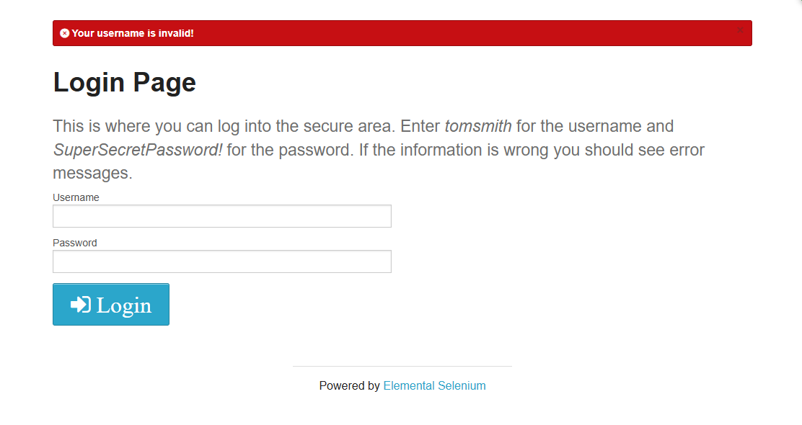

# Test Cases – Functional Testing Evidence

This section contains evidence collected during the execution of functional test cases, covering both **positive and negative scenarios**.

The goal of these tests is to validate the system behavior under expected conditions (valid inputs) and unexpected conditions (invalid inputs or edge cases).

## Scope of Testing

The following modules were tested:

* **Authentication** (Login functionality)
* **Data Validation** (Input field validation)
* **Session Control** (Access and logout behavior)

## Test Coverage

* **Positive Testing**
  Ensures that the system works correctly with valid inputs and expected user actions.

* **Negative Testing**
  Ensures that the system properly handles invalid inputs and prevents incorrect or unauthorized actions.

## Evidence Organization

Each test scenario includes:

* A brief description of the test case
* Expected system behavior
* A screenshot (evidence) demonstrating the result

All evidence is embedded directly in this document for better readability and traceability.

---

# Functional Testing – Positive Scenarios

## Authentication Module

---

### Scenario: Valid Login

User logs in using valid credentials and successfully accesses the secure area of the system.

**Expected Behavior:**
The system should authenticate the user and redirect to the secure page.

**Evidence:**

---

### Scenario: Login After Logout

User logs out from the system and then performs a new login using valid credentials.

**Expected Behavior:**
The system should allow the user to log in again and access the secure area normally.

**Evidence:**

---

# Functional Testing – Negative Scenarios

## Authentication Module

---

### Scenario: Login with Invalid Username

User attempts to log in using an invalid username and a valid password.

Expected Behavior:
The system should deny access and display an error message indicating invalid credentials.

Evidence:

---

### Scenario: Login with Invalid Password

User attempts to log in using a valid username and an invalid password.

Expected Behavior:
The system should deny access and display an error message indicating invalid credentials.

Evidence:

---

### Scenario: Empty Username Field

User attempts to log in without filling in the "Username" field.

Expected Behavior:
The system should block the login attempt and display a validation message indicating that the field is required.

Evidence:

---
